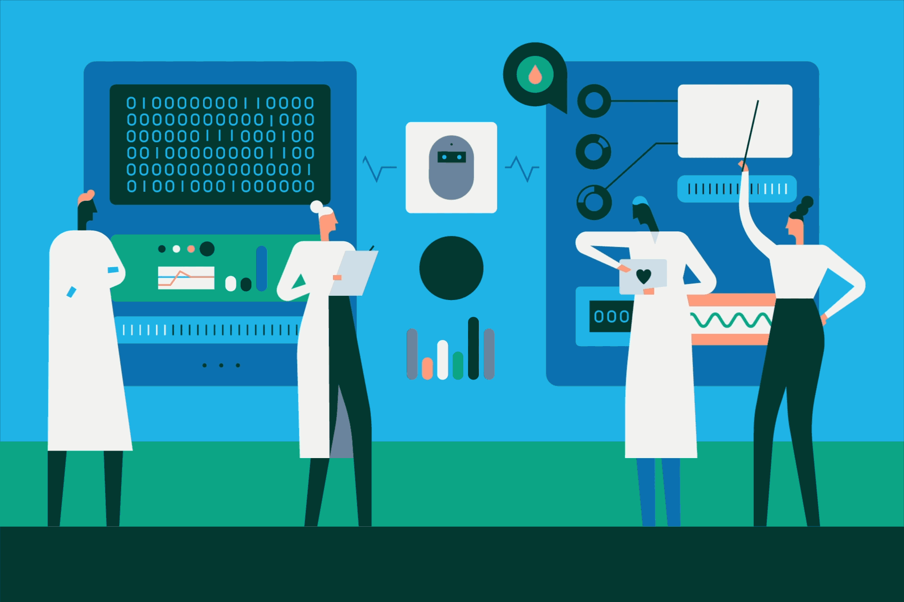
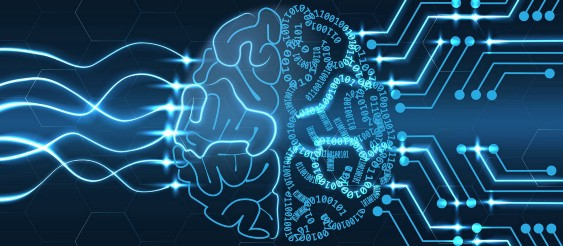
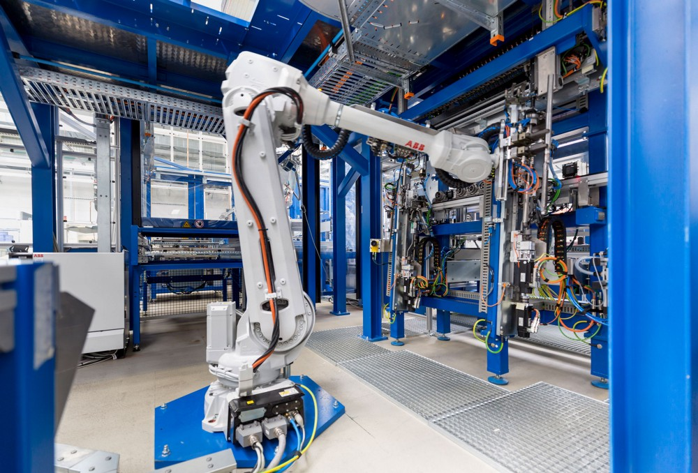

# ***Neural Networking Need of Today’s World***

### *♦ What is a Neural Network ?*

An Artificial Neural Network or Neural Network is the piece of a computing system designed to simulate the way the human brain analyzes and processes information. An artificial neural network (ANN) is the component of artificial intelligence (AI) that is meant to simulate the functioning of a human brain. Processing units make up ANNs, which in turn consist of inputs and outputs. The inputs are what the ANN learns from to produce the desired output.

These artificial networks may be used for predictive modeling, adaptive control and applications where they can be trained via a dataset. Self-learning resulting from experience can occur within networks, which can derive conclusions from a complex and seemingly unrelated set of information.

### *♦ How Artificial Neural Networks Function ?*

ANNs are statistical models designed to adapt and self-program by using learning algorithms in order to understand and sort out concepts, images, and photographs. For processors to do their work, developers arrange them in layers that operate in parallel. The input layer is analogous to the dendrites in the human brain’s neural network. The hidden layer is comparable to the cell body and sits between the input layer and output layer (which is akin to the synaptic outputs in the brain). The hidden layer is where artificial neurons take in a set of inputs based on synaptic weight, which is the amplitude or strength of a connection between nodes. These weighted inputs generate an output through a transfer function to the output layer.

### *♦ What are the Use Cases of Neural Network ?*

There are lots of different applications for neural networks that involve recognizing patterns and making simple decisions about them. eg .

In airplanes, you might use a neural network as a basic autopilot, with input units reading signals from the various cockpit instruments and output units modifying the plane’s controls appropriately to keep it safely on course.

Inside a factory, you could use a neural network for quality control. Let’s say you’re producing clothes washing detergent in some giant, convoluted chemical process. You could measure the final detergent in various ways (its color, acidity, thickness, or whatever), feed those measurements into your neural network as inputs, and then have the network decide whether to accept or reject the batch.

Suppose you’re running a bank with many thousands of credit-card transactions passing through your computer system every single minute. You need a quick automated way of identifying any transactions that might be fraudulent — and that’s something for which a neural network is perfectly suited. Your inputs would be things like 1) Is the cardholder actually present? 2) Has a valid PIN number been used? 3) Have five or more transactions been presented with this card in the last 10 minutes? 4) Is the card being used in a different country from which it’s registered? — and so on. With enough clues, a neural network can flag up any transactions that look suspicious, allowing a human operator to investigate them more closely. In a very similar way, a bank could use a neural network to help it decide whether to give loans to people on the basis of their past credit history, current earnings, and employment record.

## *♦ Some Real Life Use Cases of Neural Networking*

## *Google Translate*

Google’s automatic translation, for example, has made increasing use of this technology over the last few years to convert words in one language (the network’s input) into the equivalent words in another language (the network’s output). In 2016, Google announced it was using something it called Neural Machine Translation (NMT) to convert entire sentences, instantly, with a 55–85 percent reduction in errors. This is just one example of how Google deploys neural-network technology: Google Brain is the name it’s given to a massive research effort that applies neural techniques across its whole range of products, including its search engine. It also uses deep neural networks to power the recommendations you see on YouTube, with models that “learn approximately one billion parameters and are trained on hundreds of billions of examples.”

## *Apple Face recognition*

Apple has taken security to the next level with the introduction of Face ID, a more secure alternative to Touch ID that enables iPhone owners to keep their handset secure. With this technology, an iPhone owner can just look at their phone and it will unlock, no other interaction needed.
Apple has tapped multiple neural networks for this feature, and it doesn’t shy away from discussing how secure Face ID is. While Touch ID has a 1 in 50,000 chance that a random person could unlock the phone, Face ID brings that number up to a huge 1 in 1,000,000. The only thing that can easily foil the software, says Apple, is if you have an identical twin.

## ***♦ Conclusion***
Like this there are N number of use cases of neural networking in the world right now. The computing World has a lot to gain from the Neural Network. Thus, Their ability to learn by example makes them very flexible and powerful.

### ***Thankyou For Reading***
### ***Any query and suggestion are always welcome-*** [Gaurav Pagare](https://www.linkedin.com/in/gaurav-pagare-8b721a193/)
